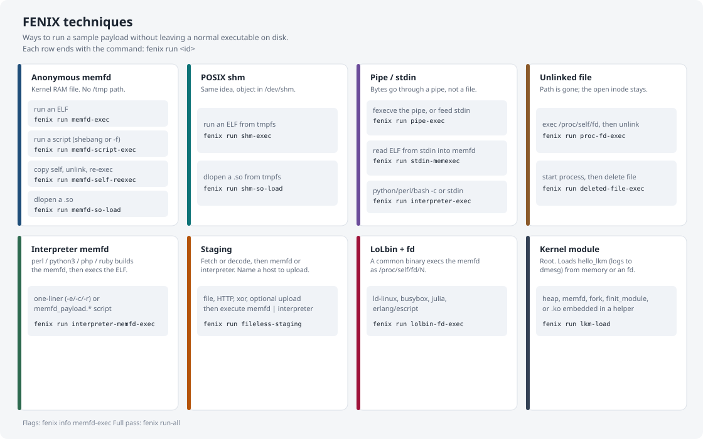

<h1 align="center">FENIX</h1>
<p align="center">
  Fileless Execution for NIX<br>
  Linux lab helpers for fileless execution
</p>

FENIX is a small toolkit for reproducing Linux fileless execution in a lab: memfd, shm, pipes, unlinked files, interpreter loaders, LoLbins, and a benign test LKM. The point is to generate the syscalls and process trees those patterns produce, on machines you own, so you can see what they look like in telemetry.

Sample payloads print `hello from fenix` or sleep. This repo does not ship detection rules or SIEM content.

## Features

- 15 techniques, C helpers, YAML examples
- `fenix run-all` walks the coverage matrix
- `fenix cleanup` removes `/tmp`, `/dev/shm`, and lab LKM leftovers
- `fenix run` prints a syscall walkthrough (`--no-explain` turns it off)

<p align="center">
  
</p>

Each box is a place the payload can sit (memfd, shm, pipe, and so on). Rows end with `fenix run <id>`. Flags: `fenix info <id>`. Notes: [docs/](docs/README.md).

## Requirements and getting started

Linux (x86_64 or aarch64), Python 3.10+, `gcc`, `make`. Kernel headers for `lkm-load`. Root for LKM and `run-all --full`.

```bash
git clone https://github.com/elastic/fenix.git && cd fenix
make all
python3 -m venv .venv && source .venv/bin/activate
pip install -e .
export FENIX_BIN_DIR=$PWD/bin
fenix check
```

Not on PyPI. `sudo fenix` will miss the venv; pass `$PWD/.venv/bin/fenix`.

## Usage

```bash
fenix run memfd-exec --payload payloads/hello_elf/hello --method procfs-fd
fenix run interpreter-memfd-exec --interpreter perl --mode one-liner
cat payloads/hello_elf/hello | fenix run stdin-memexec --method execveat
fenix run lolbin-fd-exec --lolbin ld-linux
fenix run -c examples/memfd_exec.yaml

F="$PWD/.venv/bin/fenix"
$F run-all
sudo env FENIX_BIN_DIR=$PWD/bin $F run-all --full
$F cleanup
```

## Disclaimer

Do not run this against systems you are not allowed to test.

Helpers call `memfd_create`, `execveat`, `init_module`, and similar APIs. Antivirus and GitHub scanners may flag them. See [SECURITY.md](SECURITY.md).

Issues and pull requests are not accepted.

## License

Apache License 2.0, Copyright Elasticsearch B.V. ([LICENSE](LICENSE), [NOTICE](NOTICE)).

`payloads/hello_lkm/hello_lkm.c` is GPL-2.0-only because it includes Linux kernel headers. Everything else is Apache-2.0.
